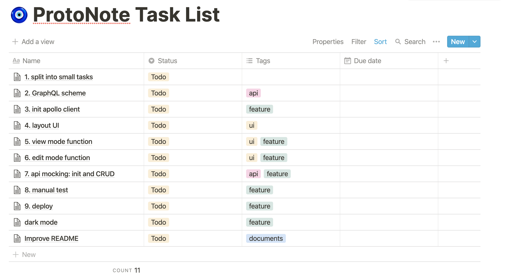

# ProtoNote

> **DEMO PROJECT! ([spec](https://gist.github.com/mmso/9097e36918084fa8ab3b0bb823327201))**

Make your contents safe. A secure notes editor.
- support markdown.
- support dark mode.


#### Technology stack
- **Framework**: [React.js](https://reactjs.org) for build UI, and [Next.js](https://nextjs.org) for production.
- **State control**: [Apollo Client](https://www.apollographql.com/docs/react/)  with [GraphQL](https://graphql.org) for local state and api mocking.
- **Typescript**: for better developer experience.
- **Markdown editor**: [react-markdown](https://github.com/remarkjs/react-markdown)
- **UI**: [styled-components](https://styled-components.com)

This project is bootstrapped with [my-frontend-boilerplate](https://github.com/TseHang/frontend-boilerplate).


#### Some thoughts
1. [What is the project's scenerio in my mind?](#what-is-the-projects-scenerio-in-my-mind)
2. [What is my workflow?](#what-is-my-workflow)
3. [Why not use Redux or React local state?](#why-not-use-redux-or-react-local-state)

## Usage

First, install node_modules and run the development server

```bash
yarn  # install dependencies
yarn dev # run the development server
```

Open [http://localhost:3000](http://localhost:3000) with your browser to see the result.


#### Other commands

Build:
```bash
yarn build
```

Run production:
```bash
yarn start
```


## Schedule & Task list
In real work scenerio, we usually use another application for task tracking and management. I use [Notion](https://www.notion.so/product) for task management here.

**[Here is my task list link](https://www.notion.so/mengtse/aeee76b7f9fc4d53af217610231d9bec?v=aa9a7efe74a643dcbe0e000dcad9253e), you can see how I split into small tasks and how I manage them.**


(Add number at the beginning of name is for sorting and sequence. Usually we sort by due date or priority.)


## Time management
| Date | time(mins) | works |
| ---- | ---- | --- |
| 10/17 | 60 | scope definition / documentation / init project |
| 10/17 | 55 | split small tasks / improve README |


## Futhermore...

#### What is the project's scenerio in my mind?
In my imagination, the project is a real task assigned to a team on REAL WORK.

Therefore, if I am the project leader, the workflow should not be coding first, but starting from scoping definition, then writing documentation, then discussing GraphQL schema with frontend/backend, and finally coding.

Here is the flow:
1. scope definition
2. documentation
3. split to small tasks
3. discuss GraphQL scheme
4. coding
5. debug & test(If I have time.)
6. deploy

Here is the scope definition of this project:
1. Technology: React / Typescript / GraphQL
2. Complete the [specification](https://gist.github.com/mmso/9097e36918084fa8ab3b0bb823327201), and I want to add a funny feature, dark mode
3. We have backend, so maybe we need api mocking if backend is not ready.

#### What is my workflow?
In this project, I plan to do:
1. Write scope definition, some thoughts and thinking process in README.
2. Using Notion for [tasks management](https://www.notion.so/mengtse/aeee76b7f9fc4d53af217610231d9bec?v=aa9a7efe74a643dcbe0e000dcad9253e), and recording problems I encountered and solution I found in each task.
3. Imaging backend exists, writing GraphQL scheme.
4. Open Pull Request on Github for each task.
5. Open issues on Github, adding it into my task list at the same time.
6. Deploy

Here is my real work experience:

Before starting, I like to write some thoughts or scope definition first, it is good to help me thinking and entering the situation quickly.

In task management, I prefer using an application like Jira, Asana and Notion to focus on **each task**, including development tasks, issue tasks, improvement tasks and test tasks.

In negotiation, if it is about whole project, which can be discussed in our team communication application, like Slack. If it is about task, just discuss under each task in our task management application.

In development, open Pull Request for each task or task's sub task. Must one of reviewers approved and CI test success, the PR can be merged into master.


#### Why not use Redux or React local state?
**For demo, I think React state and context is enough and suitable for small project.**

However if the project is a real task on work, I will choose to use Redux or Apollo Client. Redux is a good state management library for complex application, and so does Apollo Client. The difference is Apollo Client enables you to manage both local and remote data with GraphQL.

In most scenerio, we have backend, which means data is from remote. I prefer using GraphQL to manage remote data since it lets frontend and backend works more closer. Moreover, Apollo Client can automatically combines both remote data and local data, caching and updating UI.

Therefore, I choose using Apollo Client.